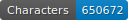
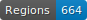
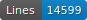
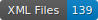

    

# Repository overview

This GitHub repository brings together all the materials required for the digital edition of the *Histoire de Kanor et ses freres*, as preserved in manuscript BnF fr. 1446. It includes:
* Source files for the various transcriptions,
* Source images used for the transcriptions,
* Bibliographic references
* Detailed guides to help users understand and utilize this edition.
 
This project provides a comprehensive and accessible foundation for studying and exploring this particularly fascinating version of the Roman de Kanor, the last of the *continuations des Sept Sages de Rome*. It is also part of a doctoral research project conducted by Florian-Pierre Zanardi (Unige/Lyon-II) and directly contributes to the FNS project “**Camonizing the Seven Sages**” (C7S), led by Professor Yasmina Foehr-Janssens (UNIGE) and Simone Ventura (ULB).

## A few words about the ms. BnF fr. 1446

The manuscript BnF fr. 1446 is significant in many respects. It stands out for the richness and originality of the works it contains, some of which can be considered outstanding. Among these is a non-cyclic and composite version of the final continuation of the Cycle of the Seven Sages of Rome, the *Roman de Kanor*. This manuscript is also notable for drafts and sketches attributed to Baudouin Butor, found in the lower margins of folios 70 to 109 and folios 108 to 115. These documents are invaluable for studying the genesis of the *Roman de Perceforest*.
Additionally, the fr. 1446 includes a unique manuscript of the *Couronnement de Renart*, a version of the *Roman de Renart*, as well as one manuscript of Marie de France’s *Fables*. Finally, its second part brings together three originally separate codices containing the poetic works of Baudouin and Jean de Condé.

## Find a title

The primary goal of the digital component of this project is to produce a semi-diplomatic transcription of the *Roman de Kanor*, as preserved in the manuscript [BnF fr. 1446, ff. 1rA-70rB](https://gallica.bnf.fr/ark:/12148/btv1b10023851v).

The ground truths were created using [eScriptorium](https://escriptorium.inria.fr), an open-source platform dedicated to the production of digital editions. This instance, generously provided by Ariane Pinche on the servers of [Inria](https://inria.fr/), leverages the Kraken OCR engine for transcription and text recognition.

