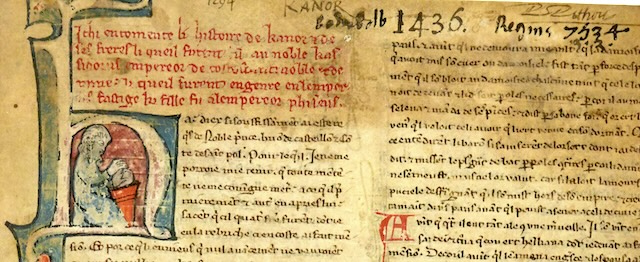

    

# *Li histoire de Kanor et ses freres*, ms. BnF fr. 1446

*Ichi encomence li histoire de Kanor et de ses freres, li queil furent fil au noble Kassidorus, empereor de Costostinnoble et de Rome, li queil furent engenré en l'emperis Fastige, ki fille fu a l'empereor Phiseus.*

# 📚 Repository Overview  

*This DH project is a work in progress.*

## 📂 GitHub structure

This GitHub contains two repositories:  
- [`kanor_xml_ocr/`](https://github.com/kanor-c7s/kanor_ocr/) for image files, ALTO transcriptions, and a trained model
- [`kanor_xml_tei/`](https://github.com/kanor-c7s/kanor_xml_tei/) for XML-TEI files, guides, glossary, and HTML outputs

## 🖋️ Project Description  

This repository hosts a digital edition of the medieval French novel *Li Histoire de Kanor et ses frere* in XML-TEI format.

This work is part of Florian-Pierre Zanardi’s doctoral research (UNIGE/Lyon-II) and contributes to the FNS project **Camonizing the Seven Sages** (C7S), led by Professors Yasmina Foehr-Janssens (UNIGE) and Simone Ventura (ULB).

The goal is to produce a sustainable, searchable, and scholarly edition that facilitates the reading and study of this non-cyclical version of the *Roman de Kanor*, final continuation of the *Cycle des Sept Sages de Rome*.

The DH project includes:
- Source files and manuscript images
- Controlled dataset, transcriptions and editorial guides
- An XML-TEI edition
- A custom transcription model trained on ms. BnF fr. 1446
- An on-going glossary of the text

---

## 📜 Manuscript BnF fr. 1446  

Manuscript BnF fr. 1446 is notable for: 
- A non-cyclic, composite version of the *Roman de Kanor*, the last continuation of the *Cycle des Sept Sages de Rome*
- Drafts and sketches attributed to Baudouin Butor, found in the margins of folios 70 to 109 and folios 108 to 115, which are important for studying the genesis of the *Roman de Perceforest*
- One unique manuscript of the *Couronnement de Renart*, a version of the *Roman de Renart*
- A witness to Marie de France’s *Fables*
- Three originally separate codices in its second part, containing poetic works by Baudouin and Jean de Condé

---

## 🎯 Aims and Methods

### 🛠️ Objectives

The primary aim of this DH project is to produce a semi-diplomatic transcription of the *Roman de Kanor*, as preserved in [BnF fr. 1446, ff. 1rA–70rB](https://gallica.bnf.fr/ark:/12148/btv1b10023851v). This transcription serves as a base for creating a searchable XML-TEI edition.

### ⚙️ Tools and Workflow

Ground truths were generated using [eScriptorium](https://escriptorium.inria.fr), an open-source transcription platform leveraging the Kraken OCR engine.

The manuscript layout was annotated using [SegmOnto](https://segmonto.github.io/) controlled vocabulary.

The eScriptorium instance was generously created by Ariane Pinche and hosted on the [Inria](https://inria.fr/) servers.

---

## ✍️ Transcription Standards  

The first transcription follows guidelines from Ariane Pinche’s *Transcription Guidelines for 10th to 15th Century Manuscripts* (2022) ([hal-03697382](https://hal.science/hal-03697382/document)) and tries to align with recommendations from the [cremma-medieval/HTR-United initiative](https://github.com/HTR-United/cremma-medieval).

### 📐 Editorial Choices  

The **first transcription** follows a "pseudo-graphematic" approach:  
- Allographs are normalized into single letters, but their original sequence is not preserved
- Words are directly segmented to align with modern conventions and streamline editing

Despite these adjustments, key features are retained:  
- Original spellings of words
- Abbreviation systems
- Punctuation marks
- Text structure, including word and line segmentation
- Scribal additions, deletions, and their contexts

These choices balance fidelity to the manuscript with usability for modern readers. The ALTO output files are stored in [`/kanor_ocr/xml_ocr/bnf_fr_1446/ground_truth/xml_alto/`](https://github.com/kanor-c7s/kanor_ocr/tree/main/bnf_fr_1446/ground_truth/xml_alto/)

The **second transcription** follows most of the guidelines from *Conseils pour l'édition des textes médiévaux* (fasc. 1-3) by Olivier Guyotjeannin, Pascale Bourgain, and Françoise Vielliard.

---

## 📤 Outputs  

Only DH outputs here.

| **Output Type**       | **Description**                                                                 | **Location**                                                                                     |
|------------------------|---------------------------------------------------------------------------------|--------------------------------------------------------------------------------------------------|
| **Golden Dataset**     | Checked transcriptions from 1446                | [`/kanor_ocr/xml_ocr/data/bnf_fr_1446`](https://github.com/kanor-c7s/kanor_ocr/xml_ocr/data/bnf_fr_1446) |
| **Custom OCR Model**   | Custom model trained on 40 folios from 1446  | [`/kanor_ocr/trained_ocr_model_kanor_1446/`](https://github.com/kanor-c7s/kanor_ocr/tree/main/trained_ocr_model_kanor_1446/) |
| **XML-TEI Edition**    | Encoded digital edition of *Li Histoire de Kanor*.               | [`/kanor_xml_tei/xml_tei/jns.47.jns8386.c7s-fro7.xml`](https://github.com/kanor-c7s/kanor_xml_tei/xml_tei/) |
| **Website**| Online edition                                     | [https://kanor-c7s.github.io/index.html](url) |
| **Glossary**| A TEI Lex-0 glossary                                     | [`/kanor_ocr/trained_ocr_model_kanor_1446/](https://github.com/kanor-c7s/kanor_xml_tei/glossary) |

### Notes

Minor errors do persist in the XML-ALTO files.

An **initial automatic transcription** was generated for folios 1–10 using the [Generic CREMMA Model for Medieval Manuscripts (Latin and Old French), 8–15th century](https://zenodo.org/records/7234166#.Y7f69afMJhE). Manual corrections were applied via eScriptorium, forming a golden dataset for training a custom model. A **second version** was trained on a controlled dataset of 40 folios, resulting in a model tailored to the primary hands of ms. BnF fr. 1446.

An ODD guide can be found in [`kanor_xml_tei//ODD/ODD-c7s-fro7.pdf`](https://github.com/kanor-c7s/kanor_xml_tei/blob/main/ODD/ODD-c7s-fro7.pdf)

### Acknowledgments

To be done

-Ariane Pinche (INRIA serve, model training and help), Camille Carnaille (and C7S Pelyarmenus team for help, structure, ODD, names) etc.-
-various scripts