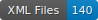

    

# Repository overview

This GitHub repository brings together all the materials required for the digital edition of the *Histoire de Kanor et ses freres*, as preserved in manuscript BnF fr. 1446. It includes:
* Source files for the various transcriptions,
* Source images used for the transcriptions,
* Bibliographic references
* Detailed guides to help users understand and utilize this edition.
 
This project provides a comprehensive and accessible foundation for studying and exploring this particularly fascinating version of the Roman de Kanor, the last of the *continuations des Sept Sages de Rome*. It is also part of a doctoral research project conducted by Florian-Pierre Zanardi (Unige/Lyon-II) and directly contributes to the FNS project “**Camonizing the Seven Sages**” (C7S), led by Professor Yasmina Foehr-Janssens (UNIGE) and Simone Ventura (ULB).

