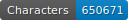

    

# 📚 Repository Overview  

*This DH project is a work in progress.*  

## 🖋️ Project Description  

This repository aims at creating a digital edition of the medieval French novel *Li Histoire de Kanor et ses frere* in XML-TEI format. The goal is to produce a sustainable, searchable, and scholarly edition that facilitates the reading and study of this non-cyclical version of the *Roman de Kanor*, final continuation of the *Cycle des Sept Sages de Rome*.  

This work is part of Florian-Pierre Zanardi’s doctoral research (UNIGE/Lyon-II) and contributes to the FNS project **Camonizing the Seven Sages** (C7S), led by Professors Yasmina Foehr-Janssens (UNIGE) and Simone Ventura (ULB).  

The repository includes:  
- Source files and manuscript images  
- Detailed transcription and editorial guides  
- An XML-TEI edition  
- A custom transcription model trained on ms. BnF fr. 1446  

---

## 📜 Manuscript BnF fr. 1446  

Manuscript BnF fr. 1446 is notable for: 
- A non-cyclic, composite version of the *Roman de Kanor*, the last continuation of the *Cycle des Sept Sages de Rome*
- Drafts and sketches attributed to Baudouin Butor, found in the margins of folios 70 to 109 and folios 108 to 115, which are important for studying the genesis of the *Roman de Perceforest*
- One unique manuscript of the *Couronnement de Renart*, a version of the *Roman de Renart*
- A witness to Marie de France’s *Fables*
- Three originally separate codices in its second part, containing poetic works by Baudouin and Jean de Condé

---

## 🎯 Aims and Methods  

### 🛠️ Objectives  

The primary aim of this DH project is to produce a semi-diplomatic transcription of the *Roman de Kanor*, as preserved in [BnF fr. 1446, ff. 1rA–70rB](https://gallica.bnf.fr/ark:/12148/btv1b10023851v). This transcription serves as a base for creating a searchable XML-TEI edition.  

### ⚙️ Tools and Workflow  

Ground truths were generated using [eScriptorium](https://escriptorium.inria.fr), an open-source transcription platform leveraging the Kraken OCR engine.

The manuscript layout was annotated using **[SegmOnto](https://segmonto.github.io/)** controlled vocabulary.

The eScriptorium instance was generously created by Ariane Pinche and hosted on the [Inria](https://inria.fr/) servers.

---

## ✍️ Transcription Standards  

The first transcription follows guidelines from Ariane Pinche’s *Transcription Guidelines for 10th to 15th Century Manuscripts* (2022) ([hal-03697382](https://hal.science/hal-03697382/document)) and tries to align with recommendations from the [cremma-medieval/HTR-United initiative](https://github.com/HTR-United/cremma-medieval).  

### 📐 Editorial Choices  

The **first transcription** follows a "pseudo-graphematic" approach:  
- Allographs are normalized into single letters, but their original sequence is not preserved
- Words are directly segmented to align with modern conventions and streamline editing

Despite these adjustments, key features are retained:  
- Original spellings of words
- Abbreviation systems
- Punctuation marks
- Text structure, including word and line segmentation
- Scribal additions, deletions, and their contexts

These choices balance fidelity to the manuscript with usability for modern readers. The ALTO output files are stored in `bnf_fr_1446/ground_truth/xml_alto`.

The **second transcription** follows most of the guidelines from *Conseils pour l'édition des textes médiévaux* (fasc. 1-3) by Olivier Guyotjeannin, Pascale Bourgain, and Françoise Vielliard.

---

## 📤 Outputs  

Only DH outputs here.

### 🏅 Golden Dataset from ms. BnF fr. 1446  

Transcriptions in `bnf_fr_1446/ground_truth/xml_alto` have been checked for accuracy, though minor errors may (do...) persist in ALTO files.  

### 🤖 Custom Transcription Model  

An initial automatic transcription was generated for folios 1–10 using the [Generic CREMMA Model for Medieval Manuscripts (Latin and Old French), 8–15th century](https://zenodo.org/records/7234166#.Y7f69afMJhE). Manual corrections were applied via eScriptorium, forming a golden dataset for training a custom model.

A second version was trained on a controlled dataset of 40 folios, resulting in a model tailored to the primary hands of ms. BnF fr. 1446. This model facilitates faster transcription across the manuscript and is available in `bnf_fr_1446/model`.  

### 📖 XML-TEI Edition  

A complete XML-TEI edition of *Li Histoire de Kanor et ses frere* has been created and is available in `xml_tei/jns.47.jns8386.c7s-fro7.xml`.

A comprehensive guide to this edition can be found in `ODD/ODD-c7s-fro7.pdf`. The edition is also accessible online: [https://kanor-c7s.github.io/index.html](url).
